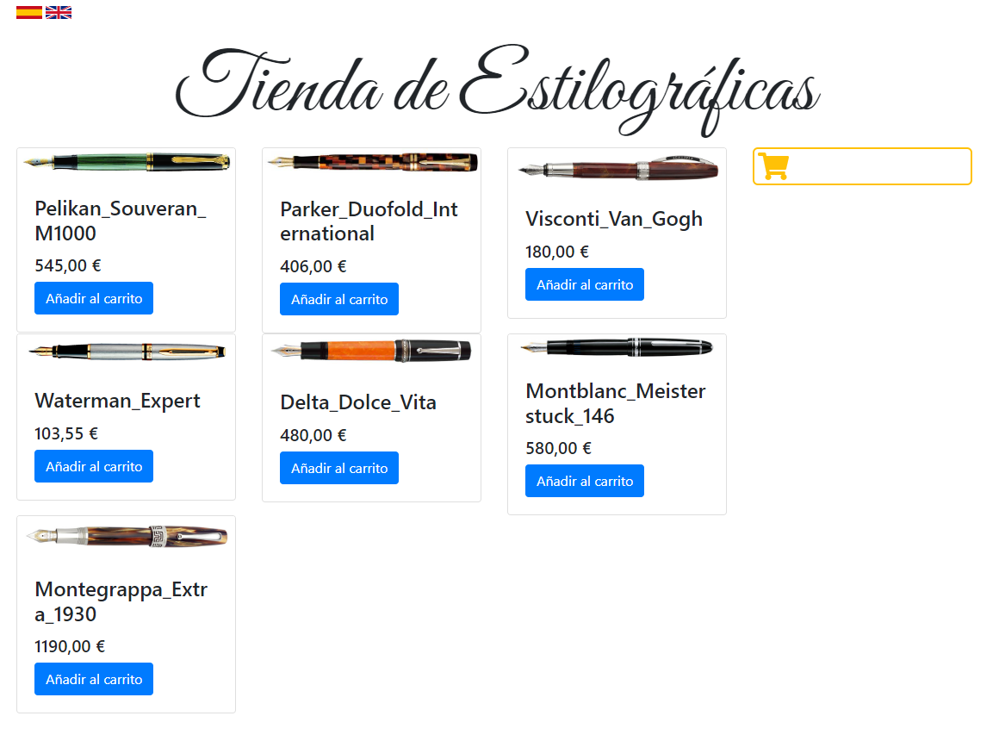
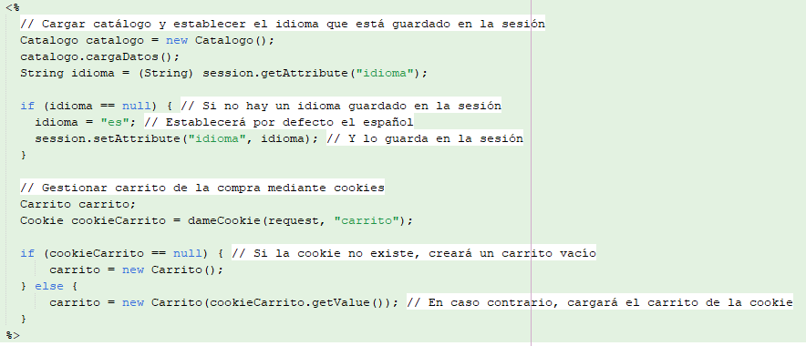
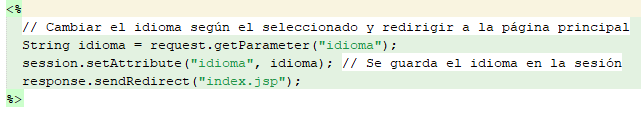
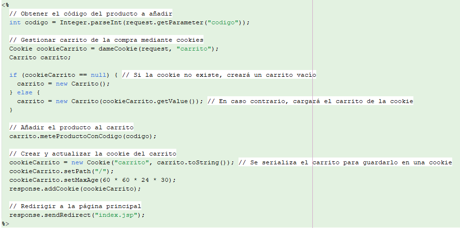
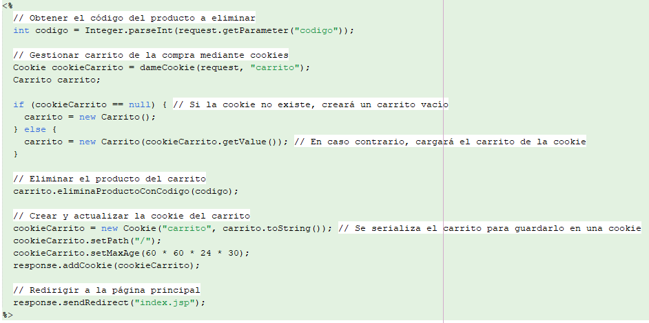
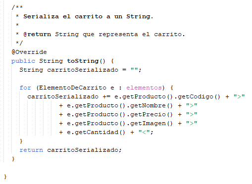
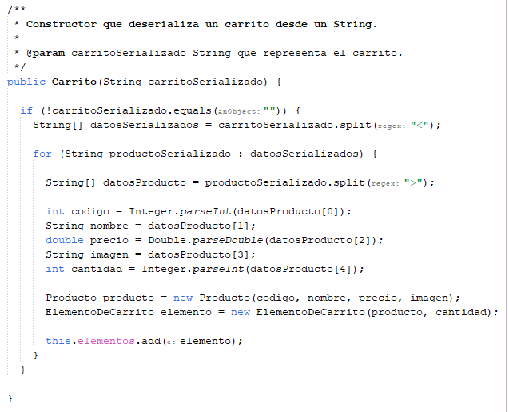

# Tienda de Estilográficas

Aplicación web para la venta de estilográficas. El proyecto está desarrollado utilizando JSP y Java, y permite a los usuarios navegar por un catálogo de productos, añadir productos a su carrito y gestionar el idioma de la interfaz.

## Características
---
- Carga del Catálogo y Gestión del Carrito:

- Se crea una instancia de Catalogo y se cargan los datos de los productos.
- Se obtiene el idioma guardado en la sesión del usuario. Si no hay un idioma guardado, se establece por defecto el español (es) y se guarda en la sesión.
- Se intenta recuperar la cookie carrito. Si no existe, se crea un nuevo carrito vacío. Si la cookie existe, se carga el carrito con los datos almacenados en la cookie.
---
- Cambio de Idioma y Redirección:

- Se obtiene el idioma seleccionado por el usuario.
- Se guarda el idioma en la sesión del usuario.
- Se redirige al usuario a la página principal con el nuevo idioma seleccionado.
---
- Añadir un Producto al Carrito:

- Se obtiene el código del producto que se va a añadir al carrito.
- Se gestiona el carrito de la compra utilizando cookies. Si la cookie del carrito no existe, se crea un carrito vacío, en caso contrario, se carga el carrito desde la cookie.
- Se añade el producto al carrito.
- Se crea y actualiza la cookie del carrito con la información actualizada del carrito, que se serializa en formato de cadena de texto.
- Se establecen las propiedades de la cookie.
- Se redirige al usuario a la página principal con los cambios en su carrito.
---
- Borrar un Producto del Carrito:

- Se obtiene el código del producto que se va a borrar del carrito.
- Se gestiona el carrito de la compra utilizando cookies. Si la cookie del carrito no existe, se crea un carrito vacío, en caso contrario, se carga el carrito desde la cookie.
- Se borra el producto del carrito.
- Se crea y actualiza la cookie del carrito con la información actualizada del carrito, que se serializa en formato de cadena de texto.
- Se establecen las propiedades de la cookie.
- Se redirige al usuario a la página principal con los cambios en su carrito.
---
- Serializar el carrito:

- Con el método toString() se serializa el carrito de la compra en una cadena de texto, para almacenar en una cookie los datos y que se mantengan después de cerrar la página.
- Este método recorre cada elemento del carrito, obteniendo los datos del producto (código, nombre, precio, imagen) y la cantidad, y los concatena en una cadena serializada.
---
- Deserializar el carrito:

- Este constructor permite deserializar un carrito a partir de una cadena de texto serializada, obteniendo los elementos del carrito a partir de la información serializada anteriormente.
- Verifica si la cadena carritoSerializado no está vacía. 
- Divide la cadena en un array de strings.
- Itera sobre cada elemento serializado.
- Divide los datos del producto en otro array de strings.
- Extrae los datos del producto (código, nombre, precio, imagen, cantidad).
- Crea un nuevo objeto Producto y un nuevo elemento de carrito con estos datos.
- Añade el nuevo elemento de carrito al carrito actual.